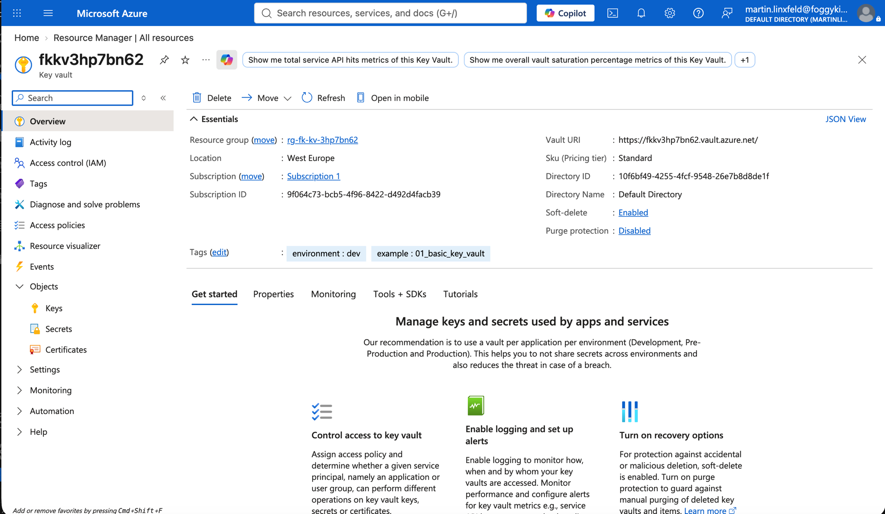

# Example 01: Key Vault (Minimal Baseline)

In this first Key Vault example, we deploy a **single Azure Key Vault**
using **Terraform / OpenTofu**.

This example introduces the **key store layer** and is intentionally kept minimal:
no access policies, no Private Endpoint, no Private DNS, no role assignments, and
no secrets, keys, or certificates.

Its only purpose is to establish a **clean, correct baseline**
for future Azure Key Vault use cases.

---

## 🧭 Architecture Overview

This deployment creates only the minimum required resources:

- One **Azure Resource Group**
- One **Azure Key Vault**

This example creates:

- Azure Key Vault with Azure RBAC authorization enabled
- Standard SKU by default
- Public network access enabled by default
- Soft-delete retention configured by the module
- Random suffix for globally unique naming
- No access policies
- No Private Endpoint
- No Private DNS
- No secret, key, or certificate objects

This is a **Key Vault foundation**, not a production-ready key management platform.

---

## 🎯 Why this example exists

Before introducing:

- Private Endpoint access,
- Private DNS,
- managed identities,
- RBAC role assignments,
- workload consumers,
- or secrets, keys, and certificates,

it is useful to start with the smallest possible Key Vault deployment.

This example focuses on:

- Establishing a correct Key Vault baseline
- Making the authorization model explicit
- Separating vault creation from identity, private networking, and consumers

Everything else builds on top of this.

---

## 🚀 Deployment Steps

From the `examples/01_basic_key_vault` directory:

```bash
cp terraform.tfvars.example terraform.tfvars
tofu init
tofu plan
tofu apply
```

This example uses the local module source from the repository root:
`../..`

---

## 🖼️ Azure Portal View



*Figure 1. Azure Key Vault deployed from the `01_basic_key_vault` example and visible in Azure Portal.*

---

## 🧹 Cleanup

```bash
tofu destroy
```

---

## 🪪 License

Licensed under the **Universal Permissive License (UPL), Version 1.0**.

---

© 2026 [FoggyKitchen.com](https://foggykitchen.com) - Cloud. Code. Clarity.
