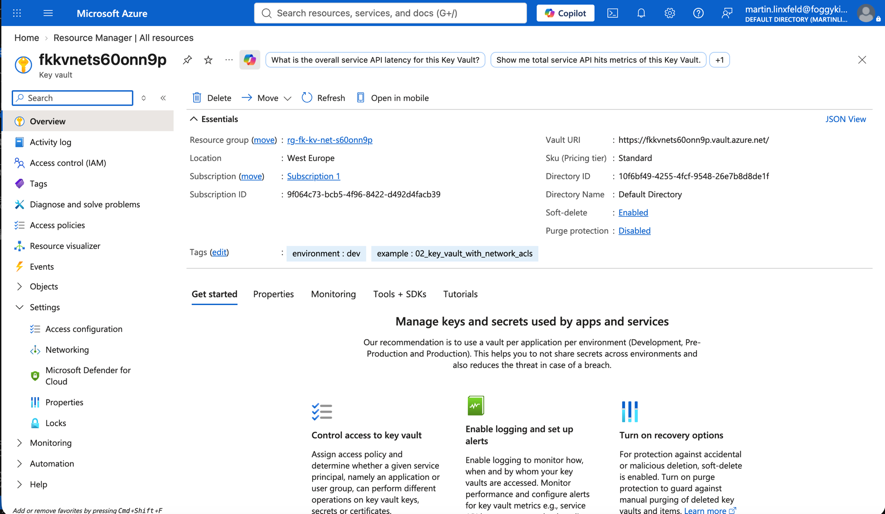
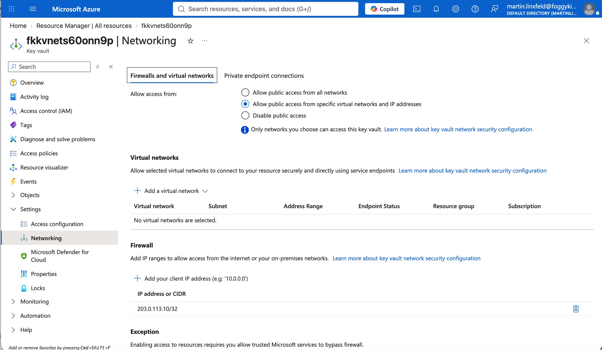

# Example 02: Key Vault With Network ACLs

This example introduces **Key Vault network ACLs**
using **Terraform / OpenTofu**.

It builds on the minimal Key Vault baseline by keeping the public endpoint
available but restricting access with deny-by-default network rules.

No Private Endpoint or Private DNS resources are created in this example.

---

## 🧭 Architecture Overview

This example creates:

- One **Azure Resource Group**
- One **Azure Key Vault**
- One **Key Vault network ACL configuration**

This example creates:

- Azure Key Vault with Azure RBAC authorization enabled
- Public network access enabled
- Network ACLs with `default_action = "Deny"`
- Azure trusted services bypass enabled with `bypass = "AzureServices"`
- Optional public IP allow-list through `allowed_ip_rules`
- Random suffix for globally unique naming
- No Private Endpoint
- No Private DNS
- No secret, key, or certificate objects

This is a **public endpoint restriction pattern**, not a fully private Key Vault.

---

## 🎯 Why this example exists

Some environments need to reduce the public exposure of Key Vault before moving
to full Private Endpoint integration.

This example focuses on:

- Showing how Key Vault network ACLs affect the public endpoint
- Keeping Azure RBAC as the data-plane authorization model
- Separating public endpoint restrictions from Private Link design

It is useful as an intermediate step between a basic Key Vault and a fully
private Key Vault pattern.

---

## 🔐 About Network ACLs in this example

Network ACLs are enabled to:

- deny public endpoint traffic by default,
- optionally allow known public IP ranges,
- keep Azure trusted services bypass explicit.

Important:

- if `allowed_ip_rules` is empty, normal public client access is denied,
- this example does not prove private access because no Private Endpoint exists,
- data-plane permissions still require Azure RBAC assignments outside this module.

---

## 🚀 Deployment Steps

From the `examples/02_key_vault_with_network_acls` directory:

```bash
cp terraform.tfvars.example terraform.tfvars
tofu init
tofu plan
tofu apply
```

---

## 🖼️ Azure Portal View



*Figure 1. Azure Key Vault deployed from the `02_key_vault_with_network_acls` example and visible in Azure Portal.*



*Figure 2. Key Vault networking configuration with public access restricted to selected networks and IP addresses.*

---

## 🧹 Cleanup

```bash
tofu destroy
```

---

## 🪪 License

Licensed under the **Universal Permissive License (UPL), Version 1.0**.

---

© 2026 [FoggyKitchen.com](https://foggykitchen.com) - Cloud. Code. Clarity.
