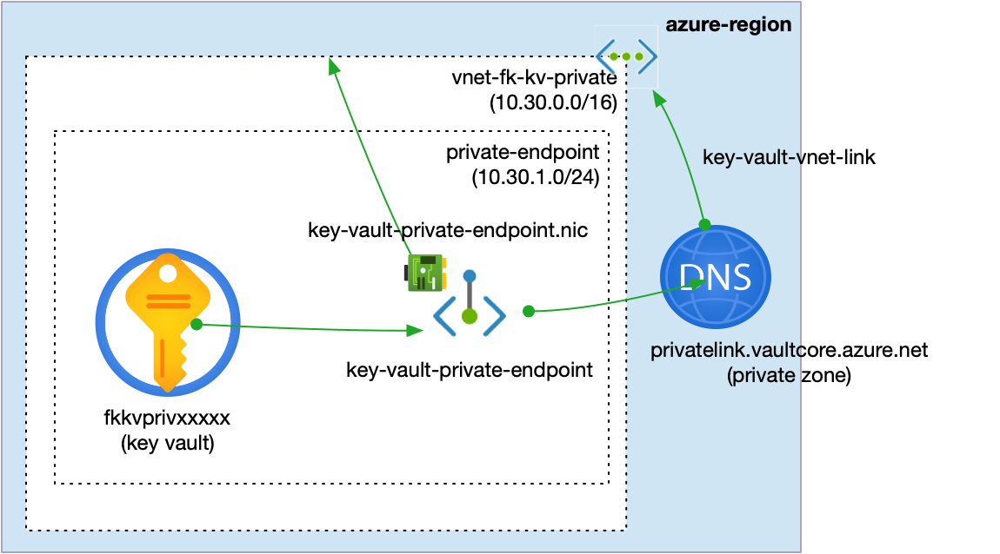
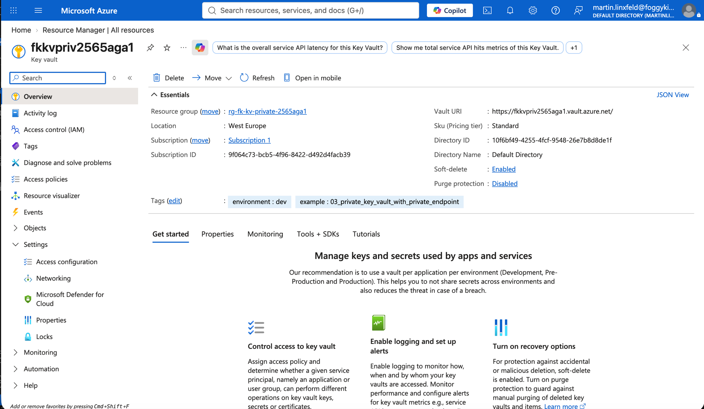
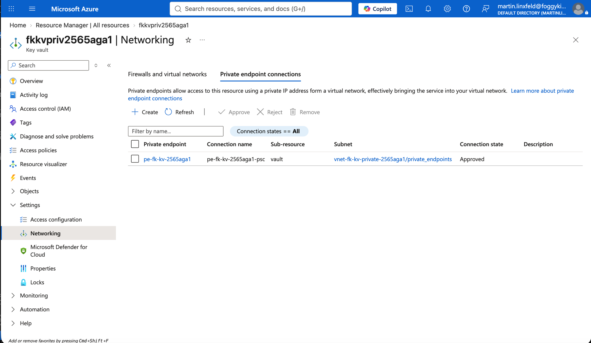
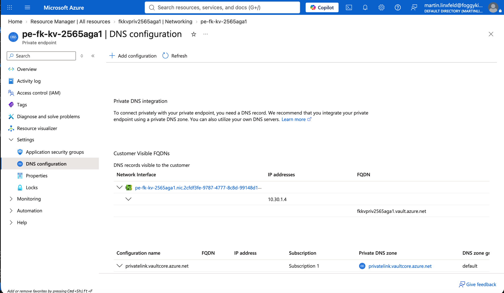
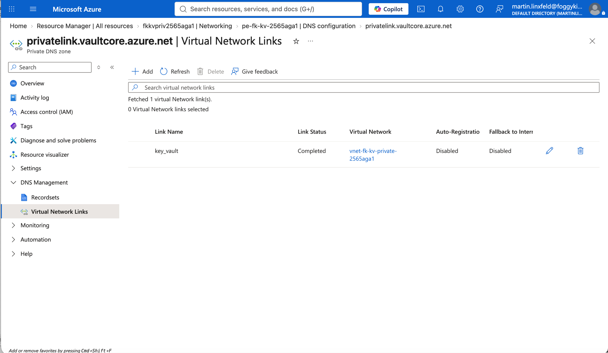

# Example 03: Private Key Vault With Private Endpoint

This example introduces a **fully private Azure Key Vault access path**
using **Terraform / OpenTofu**.

It composes:

- `terraform-az-fk-vnet`
- `terraform-az-fk-private-dns`
- `terraform-az-fk-private-endpoint`
- `terraform-az-fk-key-vault`

The Key Vault public endpoint is disabled. Workloads resolve the normal Key Vault
hostname through Azure Private DNS and reach the vault through a Private Endpoint
placed in the VNet.

---

## 🧭 Architecture Overview

This deployment creates a private Key Vault baseline for workload networks.



*Figure 1. Private Key Vault access path through Private Endpoint and Azure Private DNS.*

This example creates:

- One **Azure Resource Group**
- One **Virtual Network** via `terraform-az-fk-vnet`
- One dedicated **Private Endpoint subnet**
- One **Azure Key Vault** with public network access disabled
- One **Private DNS Zone** (`privatelink.vaultcore.azure.net`) via `terraform-az-fk-private-dns`
- One **VNet link** for private DNS resolution
- One **Private Endpoint** for the Key Vault `vault` subresource via `terraform-az-fk-private-endpoint`
- One **Private DNS Zone Group** attached to the Private Endpoint

This example creates:

- Private IP-based access to Key Vault
- DNS integration for standard Key Vault hostnames
- A locked-down Key Vault public surface
- No public data path to Key Vault
- No secrets, keys, or certificates
- No managed identities or RBAC role assignments
- No workload runtime

This is a **private key store baseline**, not a complete application deployment.

---

## 🎯 Why this example exists

The next logical step after network ACLs is to remove the public Key Vault
surface from the data path and expose the vault privately inside a workload VNet.

Private Endpoints provide:

- private IP-based access to Azure PaaS services,
- traffic that stays on the Azure backbone,
- native integration with Virtual Networks and Private DNS.

This example focuses on:

- Understanding how Key Vault works with Private Link
- Seeing the role of `privatelink.vaultcore.azure.net`
- Keeping DNS, private endpoint, VNet, and Key Vault concerns separate
- Providing a private key store pattern for later workload examples

Secrets, keys, certificates, identities, and RBAC role assignments are
intentionally out of scope for this example.

---

## 🧩 Workload Fit

This pattern is intended for private workloads that need a private key store,
for example:

- `terraform-az-fk-container-instance` running in a VNet
- private VM workloads deployed through `terraform-az-fk-compute`
- AKS workloads with private networking and explicit Key Vault RBAC
- Container Apps with internal VNet integration

Data-plane authorization is still handled by Azure RBAC outside this module.
Private networking controls reachability; RBAC controls who can read secrets,
keys, or certificates.

---

## 🔐 About Private DNS in this example

Azure Key Vault private endpoint resolution uses:

- public hostname pattern: `<vault-name>.vault.azure.net`
- Private Link zone: `privatelink.vaultcore.azure.net`
- Private Endpoint subresource: `vault`

The Private DNS zone is linked to the VNet so workloads in that network can
resolve the Key Vault name to the Private Endpoint IP address.

Important:

- a workload must run inside the linked VNet, a peered VNet with DNS visibility,
  or another network path that can resolve and route to the Private Endpoint,
- disabling public network access does not grant permissions,
- Key Vault data-plane permissions still require Azure RBAC assignments outside
  this module.

---

## 🚀 Deployment Steps

From the `examples/03_private_key_vault_with_private_endpoint` directory:

```bash
cp terraform.tfvars.example terraform.tfvars
tofu init
tofu plan
tofu apply
```

---

## 🖼️ Azure Portal View



*Figure 2. Private Azure Key Vault deployed from the `03_private_key_vault_with_private_endpoint` example and visible in Azure Portal.*



*Figure 3. Key Vault Private Endpoint connection for the `vault` subresource in the `private_endpoints` subnet.*



*Figure 4. Private Endpoint DNS configuration showing the private IP address, Key Vault FQDN, and Private DNS zone association.*



*Figure 5. Private DNS zone VNet link connecting `privatelink.vaultcore.azure.net` to the workload VNet.*

---

## 🧹 Cleanup

```bash
tofu destroy
```

---

## 🪪 License

Licensed under the **Universal Permissive License (UPL), Version 1.0**.

---

© 2026 [FoggyKitchen.com](https://foggykitchen.com) - Cloud. Code. Clarity.
